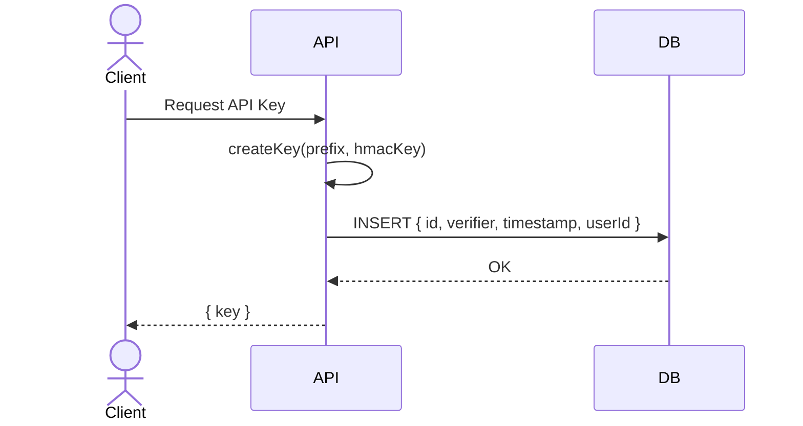
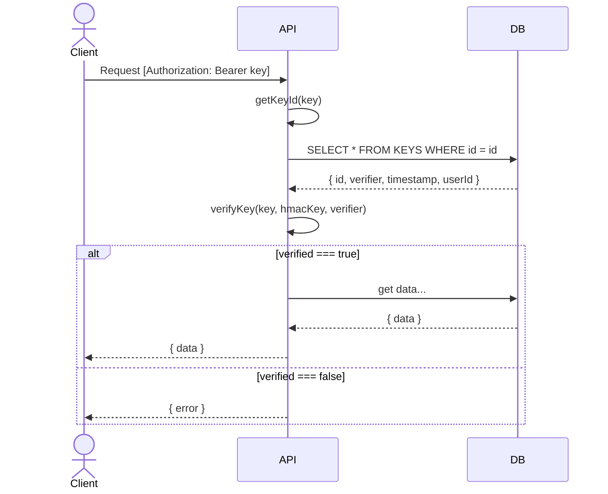

**@truestamp/prefixed-api-key** • [**Docs**](modules.md)

***

# Prefixed API Key

An API Key generator and verifier written in TypeScript and usable in Node.js, the browser, and serverless environments.

## Overview

Sample Key:

```txt
mycompany_key_01GVDPRNNV4P4593VH1A0DR7RN_1372dpVKCbEvLfM6nMsDL75GrspAj2osNVyp5RLM2s5oTjiBm
```

Prefixed API Keys of this form have many advantages:

* Simple structure, simple and secure key verification.
* Simple and instantaneous key revocation by marking a key in a database record.
8 Relatively short key length, typically less than 90 URL safe characters.
* Double clicking the API key, in most contexts, selects the entire key.
* Flexible prefixes allow easy visual identification of the key's purpose
* When registered Prefixes can be used for [secret scanning by GitHub](https://docs.github.com/en/code-security/secret-scanning/about-secret-scanning), helping to avoid the commitment of secret API keys in source repositories.
* 128 bit universally unique ULID `ID`, that includes an embedded timestamp and secure randomness, suitable for use as a database primary key.
* The `ID` can also be used to identify revoked tokens or even to revoke entire ranges of tokens based on the creation time stored in the ULID. The embedded timestamps can also be used to select an HMAC signing key used only for a range of time.
* Secret value with a 32 bytes (256 bits) of entropy known only to the client after initial generation.
* The `ID` and `SECRET` are cryptographically bound and processed by `HMAC-SHA256` resulting in a `verifier` known only to the server. The 32 byte `HMAC-SHA256` key, if secret, helps prevent forgery of keys.

An excellent read on the pros/cons of this style of key vs. stateless tokens (JWT) can be found in [fly.io/blog](https://fly.io/blog/api-tokens-a-tedious-survey/).

## Getting Started

Install:

```txt
npm install @truestamp/prefixed-api-key
```

### API

The public API of the library only exposes three functions:

#### createKey( { prefix, hmacKey } )

```ts
import { createKey } from "@truestamp/prefixed-api-key"

// hmacKey must be 32 byte Uint8Array. One possible way.
const hmacKey = sha256('my-secret-hmac-key')

const keyObj = createKey({ prefix: 'mycompany_key', hmacKey })

// OUTPUT
//
// {
//   key: 'mycompany_key_01GVDPRNNV4P4593VH1A0DR7RN_1372dpVKCbEvLfM6nMsDL75GrspAj2osNVyp5RLM2s5oTjiBm',
//   server: {
//     id: '01GVDPRNNV4P4593VH1A0DR7RN',
//     verifier: Uint8Array(32) [
//       223, 244, 199, 179,  72, 189,  74,   0,
//       144, 250, 134, 200,   0,  37,  74,  65,
//       108,  20,  94, 147, 206,  93, 116, 226,
//        71, 226, 225, 251,  70,   7, 229, 149
//     ],
//     timestamp: 2023-03-13T14:42:35.835Z
//   }
// }

```

#### getKeyId( key )

```ts
// key = 'mycompany_key_01GVDPRNNV4P4593VH1A0DR7RN_1372dpVKCbEvLfM6nMsDL75GrspAj2osNVyp5RLM2s5oTjiBm'

const id = getKeyId(key)

// '01GVDPRNNV4P4593VH1A0DR7RN'

```

#### verifyKey( { key, hmacKey, verifier, isAfter, isBefore } )

```ts
const id = verifyKey({ key, hmacKey, verifier })

// true | false
```

The optional arguments `isAfter` and `isBefore` can also be passed a `Date` object to define a starting time, ending time, or time range during which the token is considered valid.

See the [examples](./examples/) folder for Node.js and Deno runnable examples.

## API Key Creation

An API `Key` is requested to be generated server-side on demand from a `Client`. When a new `Key` is generated using `createKey()` the following takes place:

* A new unique `ULID` `id` is generated.
* A 32 byte (256 bit) secure random `secret` is generated and `Base58Check` encoded.
* The bytes of the `id` and the `secret` are concatenated and signed with `HMAC SHA-256`. The resulting signed `verifier` HMAC value is only stored by the server and is later used as the `verifier` when submitting API keys.
* The `prefix`, `id`, and encoded `secret` are concatenated into an API key string as `${prefix}_${id}_${secret}`.

A typical flow might be:



## API Key Verification

When a client wants to authenticate to a server with an API `Key` it will typically include the `Key` as an `Authorization: Bearer [KEY]` header in an HTTP request.

The API will extract the `id` from the `Key` and use that to retrieve a verifier value and other data from the database.

If found, the API will concatenate the bytes found in the `id` and `secret` parts of the `Key`, and pass them through an `HMAC-SHA256` with the HMAC signing key.

The newly regenerated HMAC output bytes will be compared to the bytes found in the DB verifier value using a secure `constant-time` byte array comparison.

If they match, the request is considered authenticated and the permissions associated with the user that owns the key can be consulted to determine what actions are authorized.

If the new HMAC output and the verifier do not match then the request MUST be rejected.



## Key Components

Each key is composed of three parts, a `PREFIX`, `ID`, and `SECRET`. These are separated by an underscore `_` character. The universe of allowed characters in a key is `[a-zA-Z0-9_]`.

These parts are concatenated in this form:

```txt
PREFIX_ID_SECRET
```

A `VERIFIER` is also created and stored separately server-side.

In this example key:

```txt
mycompany_key_01GVDPRNNV4P4593VH1A0DR7RN_1372dpVKCbEvLfM6nMsDL75GrspAj2osNVyp5RLM2s5oTjiBm
```

* `mycompany_key` is the `PREFIX`
* `01GVDPRNNV4P4593VH1A0DR7RN` is the `ID`
* `1372dpVKCbEvLfM6nMsDL75GrspAj2osNVyp5RLM2s5oTjiBm` is the `Base58Check` encoded `SECRET`

The `PREFIX` is a human readable value to help identify the `Key`

The `ID` is a unique identifier created for every API `Key` and is known to both the client and the server.

The `SECRET` is only known to the client after initial generation by the server.

The `VERIFIER` is only ever known to the server and represents the signed HMAC of the `ID || SECRET`.

### PREFIX

The prefix is used to provide a human readable description of the `Key` and is composed only of characters in the `[a-z0-9_]` range.

* It must begin and end with lowercase alphanumeric characters `[a-z0-9]`
* It can contain up to three groups of alphanumerics separated by an underscore `_`

A typical example would be `mycompany_key` or `mycompany_test_key`.

### ID

The `ID` is a 26 character [ULID](https://github.com/ulid/spec) and is shared between the client and server and is used as the database key to identify a particular `Key` to be verified.

ULID's were chosen for this identifier since they are a guaranteed to be unique and are [suitable for use as a database primary key](https://blog.daveallie.com/ulid-primary-keys). They are also URL safe and contain a timestamp in addition to random entropy.

When stored in the database, the `ID` should be stored as a string, and not decoded to bytes.

If desired, the ULID ID can also be used as the identifier to mark a key as revoked. Since all ULID's also commit to a timestamp they can be used to reject/accept keys outside a certain date range.

ULID's are:

* 128-bit compatibility with UUID
* 1.21e+24 unique ULIDs per millisecond
* Lexicographically sortable!
* Canonically encoded as a 26 character string, as opposed to the 36 character UUID
* Uses Crockford's base32 for better efficiency and readability (5 bits per character)
* Case insensitive
* No special characters (URL safe)
* Monotonic sort order (correctly detects and handles the same millisecond)

An online ULID decoder [is available](https://ulid.page/) which allows easy extraction of the timestamp component of a ULID.

### SECRET

The secret portion of the `Key` is a `Base58Check` encoded 32 byte (256 bit) random secret key. It is only made visible once to the client, at the time of `Key` generation, and this secret value is never stored by the server that created it.

This 32 byte (256 bit) secure random value has enough entropy to be considered cryptographically secure. The [@stablelib/random](https://www.stablelib.com/modules/_stablelib_random.html) library is utilized for random byte generation and will utilize secure `PRNG` functions found in Node.js or the browser's web crypto APIs.

[Base58Check](https://en.bitcoin.it/wiki/Base58Check_encoding) encoding of this random value results in a URL safe string that also encodes four bytes of a `SHA-256` hash that serves as a checksum value and prevents typos. The audited[paulmillr/scure-base](https://github.com/paulmillr/scure-base) library is used to encoded/decode the `Base58Check` values.

The `Base58` alphabet `[123456789ABCDEFGHJKLMNPQRSTUVWXYZabcdefghijkmnopqrstuvwxyz]` is URL safe and avoids the use of characters commonly found in typos.

### VERIFIER

The `VERIFIER` is the output of `HMAC-SHA256(hmacKey, ID || SECRET)`. It is only ever known, and stored, by the server side. It is a 32 Byte `Uint8Array` that can be encoded and stored as your DB prefers (e.g. Raw Bytes, Base64, Hex).

## Notes on HMAC Keys

Each API `Key` is signed with a 32 Byte (256 bit) HMAC key. The library requires this to be presented as a `Uint8Array`. You'll need to determine a key management strategy that works best for you.

Rotating keys, perhaps associating them with a date range in the ULID `ID`, is one possible scheme.

You could also use a single long term key and if it is compromised, you would revoke all keys generated prior to that date.

Another more granular option could be to combine a single secret key with a per key `salt` stored in the database alongside the API `Key`. You could then `hash(hmacSecret || salt)` to derive a per API `Key` HMAC signing key.

If the unforgeability of keys is less of a concern you could also just use the `sha256('my-company-name')` as the shared `hmacKey` with no salt. This effectively removes the security value of the signing key, and puts the burden of verifying a key on your database.  If it has a valid verifier signed with this shared `hmacKey` the API `Key` would be accepted.

This is a complex topic and you'll need to find a security solution for key management that works for you.

## Is it fast?

Try `npm run bench`

On a recent laptop it can process at the following rates (per/second):

* `~10,000` `createKey()`
* `~36,000` `getKeyId()`
* `~20,000` `verify()`

While this does not include the database call required for real world use, this performance should be sufficient for most use cases. `:-)`

## Origins

This is a fork of [seamapi/prefixed-api-key](https://github.com/seamapi/prefixed-api-key). While the usage concepts are similar, this is essentially a complete re-write to enhance the cryptographic security properties and safety when verifying a key. The keys and verifiers of these two libraries are not compatible.

We thank the [seamapi](https://github.com/seamapi) team for the inspiration.
